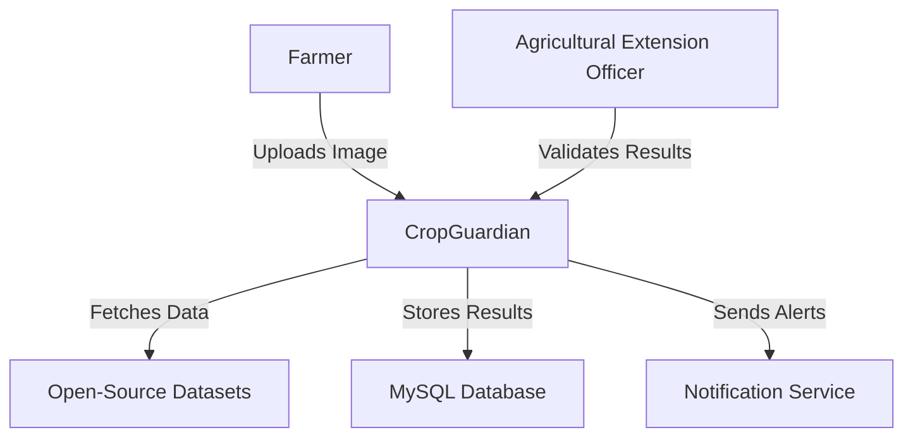
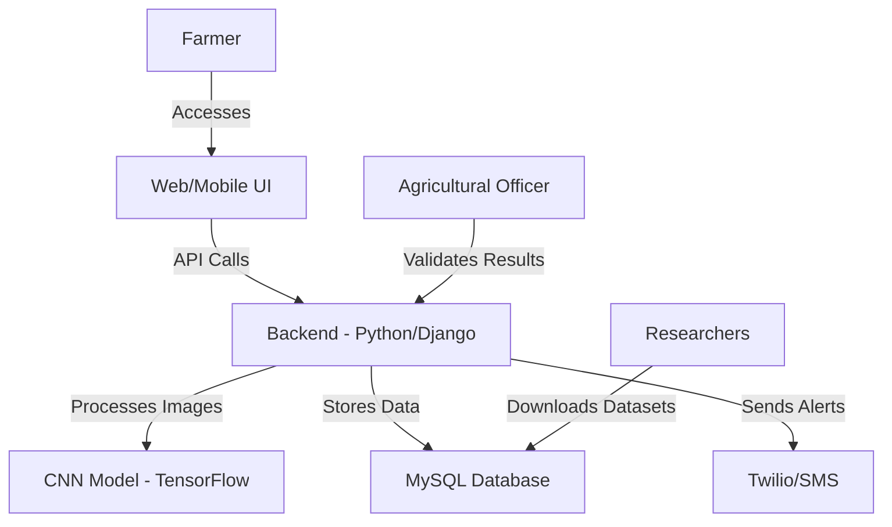
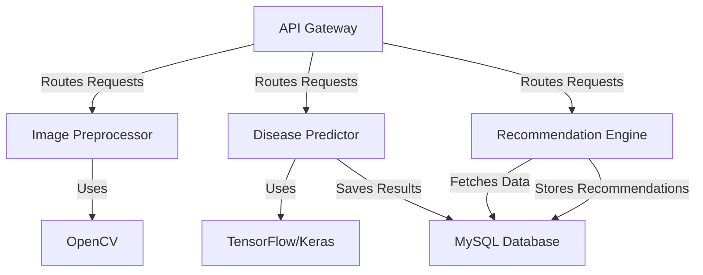
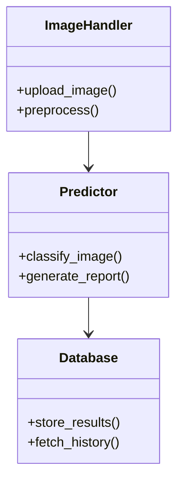

C4 Architectural Diagrams 

# C4 Architecture  

## Level 1: Context Diagram  

## Level 2: Container Diagram

## Level 3: Component Diagram 

Explanation :

API Gateway : Routes user requests to the appropriate components.
Image Preprocessor : Uses OpenCV to clean and format uploaded images.
Disease Predictor : Uses TensorFlow/Keras for CNN-based disease classification.
Recommendation Engine : Fetches treatment data from the MySQL Database .
All components interact with the database to store/retrieve results.

## Level 4: Code Diagram

Explanation :

ImageHandler : Manages image uploads and preprocessing.
Predictor : Uses the CNN model to classify images and generate reports.
Database : Stores prediction results and user history.
Arrows indicate dependencies (e.g., ImageHandler relies on Predictor).
